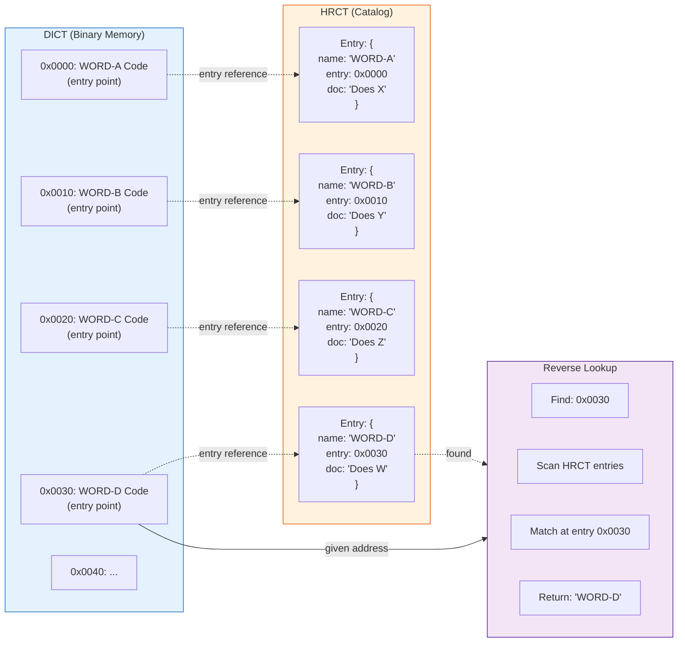

# FIFTH - a computing infrastructure 

## Outline

FIFTH is a project to develop a holistic building environment for alternative computing - a synergy of hard and software. 

It is inspired by and heavily based on FORTH, but aims to take the philosophy a step further by approaching stack-based compute from a slightly different angle.

The architecture considers two principal actors: the MACHINE and the DICT. The combination of the two creates a functional unit able to execute tasks, and in a fractal view can be deployed in architecture in a variety of roles from an independent task to a full computing system.

For those who know FORTH, the principal changes are, that FIFTH emancipates the return stack to a flow stack, facilitating dataflow paradigms in programming by stackmuxing. Primitive opcodes, specifically stack options come with muxbits which makes them executable on either stack or even cross stack, and configuration bits  that allow to build multi-primitive cells, which conditionally execute and flow.

FIFTH is not a programming language. It is an infrastructure with a common syntactic and semantic basis to create task and domain specific languages from there. In order to achieve this, it works with a maximum of 64 primitives including reserved opcodes for individual hardware solutions with heavy used opcodes directly implemented in the MACHINE. 

----

## The MACHINE
The MACHINE in FIFTH in it's minimal definition is a rotating twin-stack (like a queue), a threader and ALU plus memory and an IO device to communicate with the environment. Unless implemented in the reserved opcodes, all hardware access is considered to be memory-mapped. To be functional, a MACHINE has a bios with the sole purpose to load, save and transmit dictionaries and providing mapping to access hardware on low level. This also implies that a MACHINE does not need an OS, if its task is narrow and defined, it can just run with bios and a program.

## The DICTIONARY 
Dictionaries in FIFTH unlike in FORTH are separated in a standalone binary DICT and a referencing descriptive catalog (HRCT - human readable catalog). This allows to avoid dragging along verbose documentation in production MACHINEs. A special form of DICT is the installer, which is specified as an executable dictionary that appends itself to the dictionary space of the MACHINE and forgets the configuration part afterwards.


----

## Tagged Cells
The here developed implementation of FIFTH - Fifth32 - uses 32bit cells with 4 tag bits and 28 payload bits.
The tag bits allow the threader and stack to discriminate between executable code and data, and thus facilitate Dataflow paradigms in development.
On the execution side it permits to decide if a cell constains instructions to be executed or a location to flow to, along with execution context hints. Since consequent cell addressing is used in FIFTH, that allows  direct access to a GB of memory without paging in a single cell.
On the data side the tag bits facilitate the code to handle the tagged data accordingly, allowing a form of type hinting. This gives a cell a range of -134,217,728 to 134,217,727 as signed integer along with the possibility to identify multi-cell data from the tag bit hints.

| bit | 0 | 1 |
| ---- | ---- | ---- |
| 31 | data cell | executable cell |
| 30 | value cell | reference cell |
| 28,29  | type hints | execution and flow options |


## The Twin Rotating Stack
Unlike the Fifth16 emulation added as reference and instructive PoC, Fifth32 implemenents a pair of rotating buffers - I call them bead stacks - which allow performant transfer of TOS to the bottom of the stack (BOS) and BOS to top. While the stack is generally treated as a LIFO stack, rolling values to and from the bottom, reducing the need for >R/R> shenanigans.
This architecture is natural to implement in hardware with power-of-two sized stacks and expands programmers options significantly.

### Bead Stack Example
```text
[31][00][01][02][03][04][...][31][00]...
          a     b    c    d
// sp: 4, depth: 4
// execution of IFR- ( reverse indian file run) =>
        
[31][00][01][02][03][04][...][31][00]...
    d    a     b    c
// sp: 3, depth: 4
```
With power-of-two sized stacks this operation is cheap and needs no checking at all.

## Core Words

The final assignation of mandatory core words is still a work in progress, the final canonical specification will consider approximately a core of 32-48 opcodes and 16-32 user implementable opcodes.

``` code
[00] NOP ( -- ) * specific implementation
[01] DROP ( w:n -- )
[02] DUP ( w:n -- w:n o:n )
[03] SWAP ( w:a w:b -- w:b o:a )
[04] OVER ( w:a w:b -- w:a w:b o:a )
[05] ROT ( w:a w:b w:c -- w:b w:c o:a )
[06] ROT- ( w:a w:b w:c -- o:c w:a w:b )
[07] UNDR ( w:a b -- w:a a b )
[08] UPOP ( -- w:a ) unpop
[09] NIP ( w:a b -- o:b )
[0A] IFR ( w0:a -- o:a )
[0B] IFR- ( w:a -- o0:a )
[0C] ! ( w:cell o:a -- )
[0D] @ ( w:a -- o:val )
[0E] IPS ( -- [f:ip] a ) or skip
[0F] PICK ( w:depth -- o:v )
[10] 0= ( w:n -- o:flag )
[11] 0< ( w:n -- o:flag )
[12] !0 ( w:n -- o:n)
[13] NG ( w:n -- o:-n )
[14] ~ ( w:n -- o:~n )
[15] + ( w:a b -- o:a+b )
[16] - ( w:a b -- o:a-b )
[17] * ( w:a b -- o:a*b )
[18] / ( w:a b -- o:a/b )
[19] /% ( w:a b -- w:q o:r )
[1A] % ( w:a b -- o:a%b )
[1B] = ( w:a b -- o:flag )
[1C] < ( w: a b -- o:flag )
[1D] > ( w: a b -- o:flag )
[1E]
[1F]
// Upper range includes multi byte opcodes still to be
//defined or reserved for task specific implementation 
[20]
[21]
[22]
[23]
[24]
[25]
[26] & ( w: a (b) -- o:a&b )
[27] | ( w: a (b) -- o:a|b )
[28] ^ ( w:a (b) -- o:a^b )
[29] << ( w: n (cnt) -- o: n<<cnt ) F
[2A] >> ( w: n (cnt) -- o:n>>cnt ) F
[2B]
[2C]
[2D]
[2E] 
[2F]
[30] IP@ ( [w:a] -- w:ip [w:a])
[31] IP! ( w:ip -- ) / (--)ip += sval
[32]
[33]
[34]
[35]
[36]
[37]
[38]
[39] XSM ( w:a o:b -- wo:a +- b )
[3A] TNC! ( w:a b o:c -- w:a b )
[3B] TN+ ( * -- * ) modifies tos/nos
[3C] TNC@ ( w: a b -- w: a b o:c+?)
[3D] WLK ( w:a1 w:a2 -- w:a1+1 w:a2+1 o:fl )
[3E] MOV ( w:src w:dst o:len -- )
[3F]

